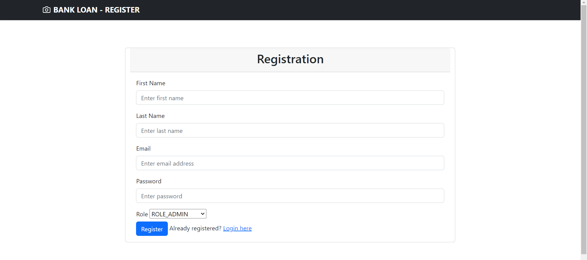
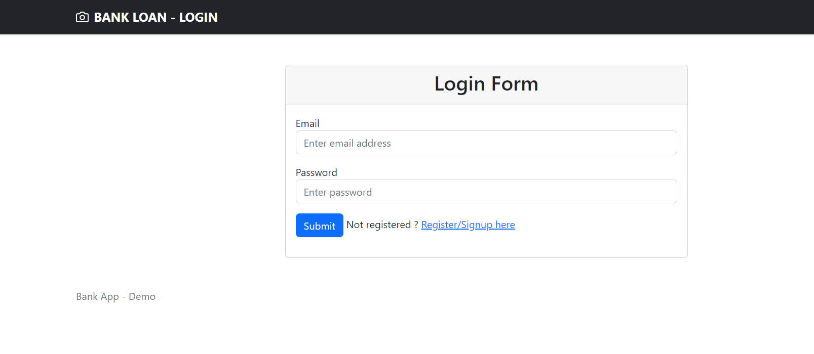
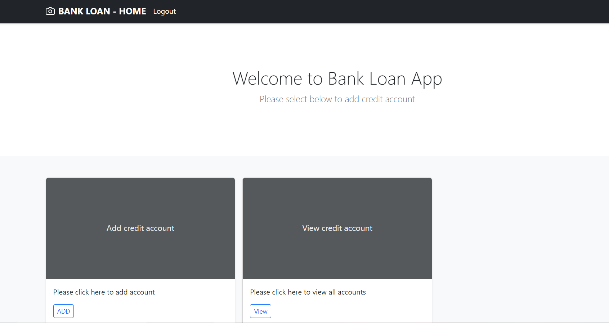
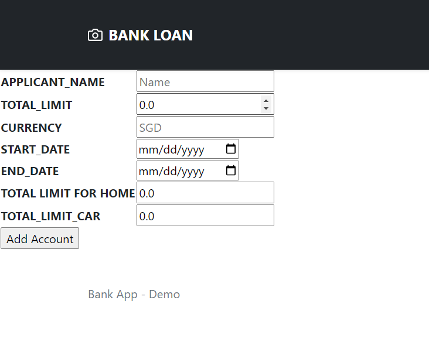
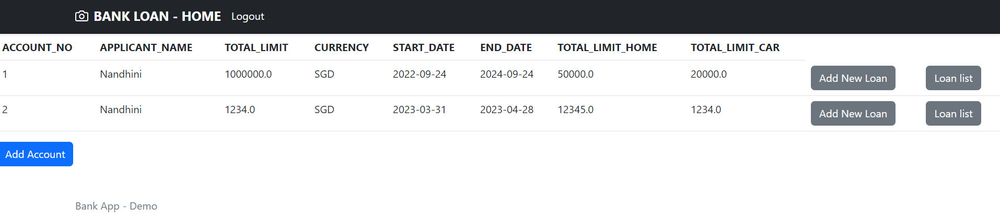
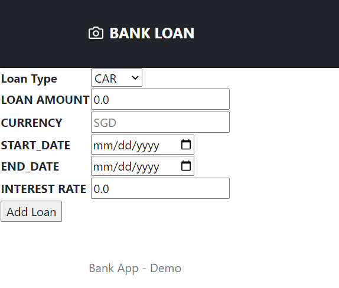
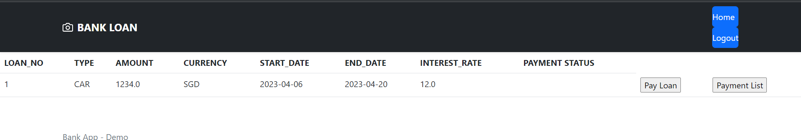
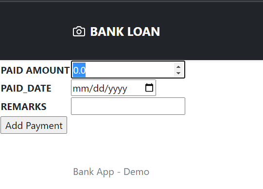
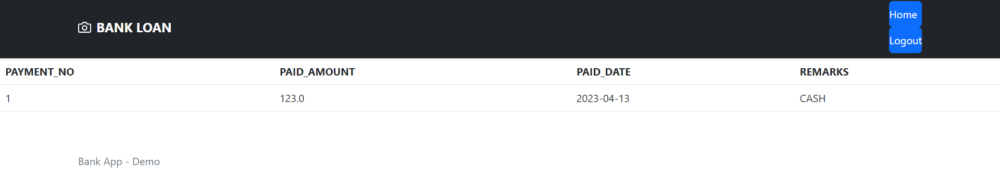

# Bank Loan -
This application includes Registration, Login, Create credit facility, Create and view loan under credit facility, Create and view payment under loan

## About
**springframework boot V2.7.4 
Java 8 
Database - h2database 
springframework security 
thymeleaf - To render UI** 
Bootstrap,CSS 
 

     Registration URL - http://localhost:8080/register
     This applicatin enables user to register their details. Admin has the authority to register. Admin login details given below
     Email - nandhuu.nandy@gmail.com
     PWD - 12345

     Login URL - http://localhost:8080/login

     HomePage URL - http://localhost:8080/home

      Credit account creation - Admin has the authority to create credit. Click Add button in the file tile in home page to create credit account. Sample credit creation page as given below.

To view accounts url - http://localhost:8080/accounts
Admin can add loan and view the loan list in below page

Create loan under the credit

View and payment

Payment creation

View payment details
